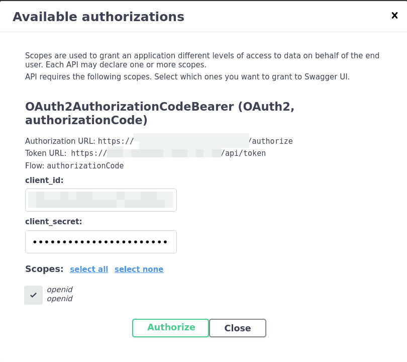
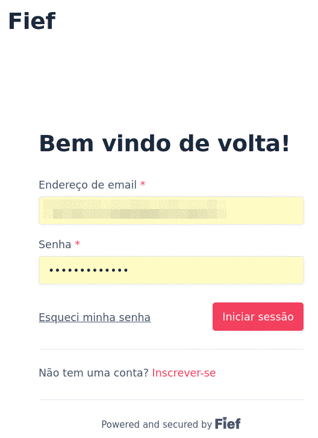
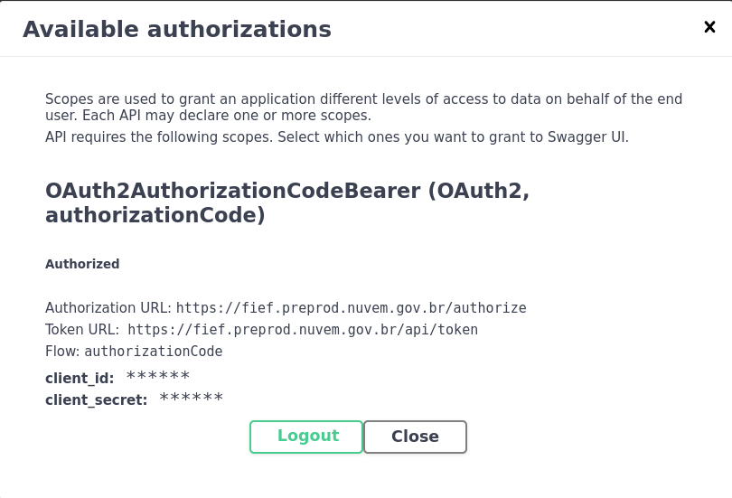
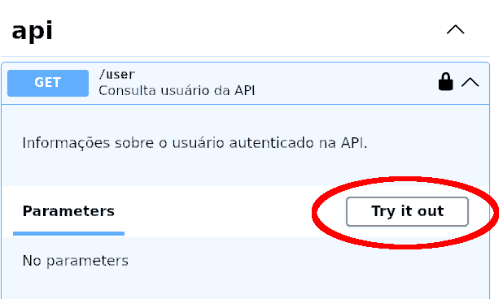
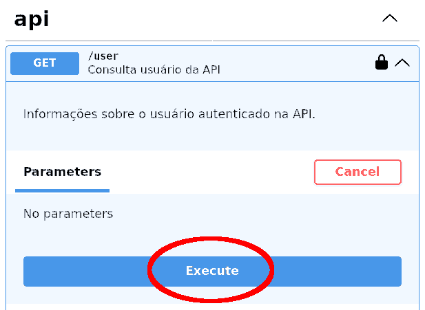
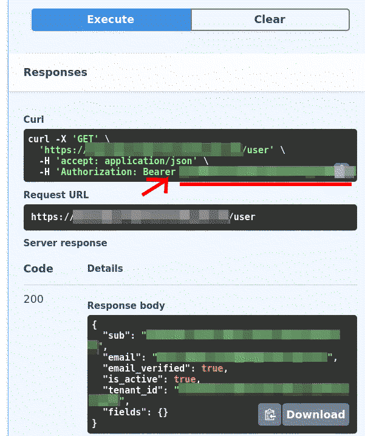

# Autenticação na API

Para se autenticar na API, primeiro acesse o endereço da interface
Swagger.

> **Qual é o endereço da interface Swagger?**
> 
> O endereço varia conforme o ambiente em que foi instalado.
> 
> Se a API foi instalada em ambiente de desenvolvimento local, no próprio
> computador, e foram seguidas as instruções do README, o endereço será
> 
> http://localhost:5057/docs/
> 
> Por outro lado, se estiver tentando usar um sistema implantado em uma
> organização e você não sabe o endereço, pergunte ao administrador do
> sistema.

## Login pela ferramenta Fief

A autenticação na API é feita por meio do protocolo OAuth 2.0, usando
a ferramenta de gestão de usuários chamada Fief.

Para começar, clique o botão "Authorize 🔓".

A próxima tela "Available authorizatins" contém os dados de autenticação
(`client_id` e `client_secret`) entre a API e a ferramenta Fief. Não se
preocupe com esta tela, pois os valores já virão pré-preenchidos.
Simplesmente clique em "Authorize" para seguir adiante.

Agora, na tela de login da ferramenta Fief que se abriu em uma nova aba,
entre com o seu nome de usuário e senha constantes no cadastro.

Após realizado o login com sucesso, a tela "Available authorizations" irá
mostrar que já está logado. Em vez do botão "Authorize", estará visível o
botão "Logout".

Clique em "Close" para fechar a janela. Agora o usuário está logado.
Caso deseje realizar operações manuais na API, poderá utilizar a
interface do Swagger e preencher os formulários.

## Acesso automatizado de modo autenticado

Para acessar os endpoints da API de forma autenticada a partir de meios
automatizados, como o `curl`, ou de linguagens de programação, como
Python, Java ou PHP, por exemplo, será necessário obter o token de acesso.

Na interface do Swagger, na seção "api", clique o endpoint `GET /user`
para expandi-lo, e em seguida o botão "Try it out".

Em seguida, clique botão em destaque "Execute".

Se tudo der certo, aparecerá na seção "Responses" uma resposta com
código 200, contendo na seção "Response body" os detalhes sobre o
usuário.

Na seção "Curl", observe a sequência de números e letras após `-H 'Authorization: Bearer xxxxxx`:

Este é o token que você precisa passar para fazer uma requisição
autenticado na API. Caso esteja a utilizar o `curl`, o próprio comando
já serve de exemplo. Caso esteja montando uma requisição em alguma outra
ferramenta ou linguagem de programação, inclua no cabeçalho o campo
"Authorization" com o valor "Bearer [token]".
