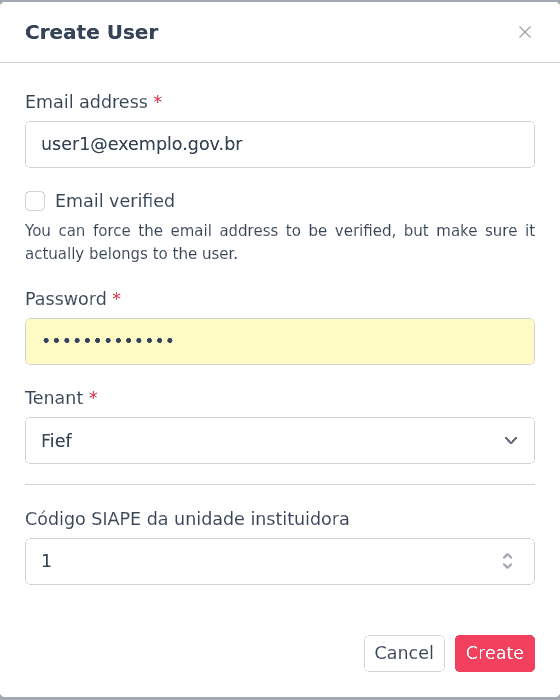

# Gestão de usuários da API do PGD

O cadastro de usuários é feito pela aplicação Fief. 

## Acesso à gestão de usuários

Para cadastrar um novo usuário, acesse pelo navegador o endereço da
aplicação Fief. 

> **Qual é o endereço do Fief?**
> 
> O endereço varia conforme o ambiente em que foi instalado.
> 
> Se a API foi instalada em ambiente de desenvolvimento local, no próprio
> computador, e foram seguidas as instruções do README, o endereço será
> 
> http://fief:8000/admin/
> 
> Por outro lado, se estiver tentando usar um sistema implantado em uma
> organização e você não sabe o endereço, pergunte ao administrador do
> sistema.

Faça o login como administrador do Fief.

> **Onde encontro as credenciais de login?**
> 
> Quando da instalação do sistema, já são fornecidas como variáveis de
> ambiente `FIEF_MAIN_USER_EMAIL` e `FIEF_MAIN_USER_PASSWORD` as
> credenciais (login e senha, respectivamente) do usuário administrador
> do Fief.

## Cadastro de usuários

Na coluna da esquerda, selecione a opção "Users" (ícone com a silhueta
de uma pessoa, 5º de cima para baixo).

Clique o botão em destaque "Create User".

Digite o e-mail e a senha do usuário, escolha no campo "Tenant" a única
opção disponível e preencha o código SIAPE da unidade instituidora do
PGD, para a qual será realizada a carga dos dados.

Caso não seja necessário enviar e-mail de confirmação do e-mail (se
você tem certeza de que o e-mail da pessoa está certo), marque a caixa
"E-mail verified".

Clique o botão em destaque "Create".

Confira se o usuário apareceu na lista de usuários. Então envie as
credenciais à pessoa. A senha cadastrada pode ser trocada pelo próprio
usuário, bastando para isso abrir o mesmo endereço da ferramenta Fief que
foi utilizada para o cadastro, porém, com as suas próprias credenciais.
